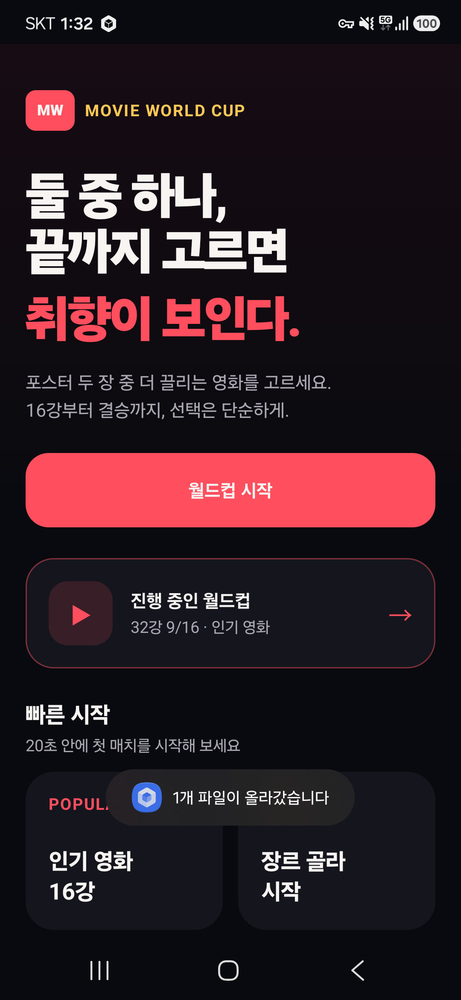
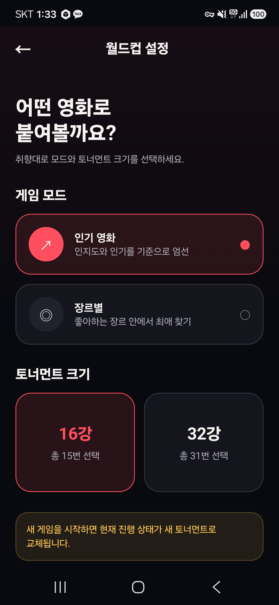
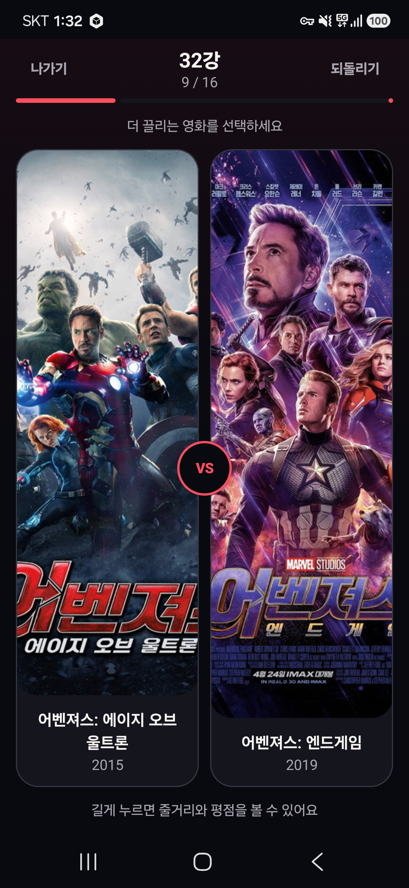

# 영화 이상형 월드컵

두 장의 영화 포스터 중 더 끌리는 작품을 반복해서 선택하고, 토너먼트 우승작과 나의 영화 취향을 발견하는 Android 앱입니다.

## 실행 화면

<p align="center">
  
  
  
</p>

<p align="center">
  <sub>홈 · 월드컵 설정 · 영화 선택 경기</sub>
</p>

## 주요 기능

- TMDB 인기 영화 및 장르별 후보 조회
- 16강 또는 32강 토너먼트 생성
- 중복 제거와 랜덤 시드를 이용한 대진표 구성
- 포스터, 제목, 개봉연도를 중심으로 한 빠른 선택 화면
- 라운드 전환 애니메이션과 직전 선택 1회 되돌리기
- 앱 종료 또는 화면 회전 후 현재 경기 복구
- 선택 결과를 이용한 선호 장르 및 시대 분석
- 우승작과 플레이 기록의 로컬 저장
- 결과 이미지 생성 및 Android 공유 시트 연동
- 이미지 로딩 실패 시 제목 기반 대체 화면 제공

## 기술 스택

| 영역 | 기술 |
| --- | --- |
| UI | Kotlin, Jetpack Compose, Material 3 |
| 상태 관리 | ViewModel, StateFlow |
| 네트워크 | Retrofit, OkHttp, Gson |
| 이미지 | Coil |
| 로컬 저장 | Preferences DataStore |
| 테스트 | JUnit 4, AndroidX Test |

## 시작하기

### 요구 사항

- Android Studio
- Android SDK 37
- Android 12 이상 기기 또는 에뮬레이터 (`minSdk 31`)
- TMDB API Read Access Token

### TMDB 토큰 설정

1. [TMDB](https://www.themoviedb.org/) 계정을 생성합니다.
2. 계정 설정의 **API** 메뉴에서 API 사용을 신청합니다.
3. 발급된 **API Read Access Token**을 프로젝트 루트의 `local.properties`에 추가합니다.

```properties
TMDB_READ_ACCESS_TOKEN=발급받은_토큰
```

Android Studio가 생성한 기존 `sdk.dir` 항목은 유지해야 합니다. `local.properties`는 Git에서 제외되며 토큰을 소스 코드, 로그, 이슈 또는 Pull Request에 포함하면 안 됩니다.

### 빌드 및 실행

Windows PowerShell에서 다음 명령을 실행합니다.

```powershell
.\gradlew.bat assembleDebug
.\gradlew.bat installDebug
```

macOS와 Linux에서는 `.\gradlew.bat` 대신 `./gradlew`를 사용합니다. 생성된 APK는 다음 경로에서 확인할 수 있습니다.

```text
app/build/outputs/apk/debug/app-debug.apk
```

## 테스트와 정적 분석

```powershell
.\gradlew.bat testDebugUnitTest
.\gradlew.bat lintDebug
.\gradlew.bat connectedDebugAndroidTest
```

- `testDebugUnitTest`: 토너먼트 진행, 라운드 전환, 되돌리기, 취향 분석 테스트
- `lintDebug`: Android 리소스와 코드 정적 분석
- `connectedDebugAndroidTest`: 연결된 기기 또는 에뮬레이터에서 계측 테스트 실행

## 프로젝트 구조

```text
app/src/main/java/com/chlqudco/movieworldcup/
├── data/       TMDB API와 DataStore 저장소
├── domain/     모델, 토너먼트 엔진, 취향 분석
├── share/      결과 이미지 생성과 공유
└── ui/         ViewModel, Compose 화면, 공통 컴포넌트, 테마

app/src/main/res/       문자열, 테마, XML 설정, TMDB 로고
app/src/test/           JVM 단위 테스트
app/src/androidTest/    Android 계측 테스트
```

UI는 ViewModel의 단일 `StateFlow`를 구독합니다. ViewModel은 도메인 엔진과 저장소를 조정하며, 진행 중인 대진표와 완료 기록은 DataStore에 저장됩니다. 토너먼트가 시작된 뒤에는 네트워크가 끊겨도 저장된 후보 정보로 경기를 계속할 수 있습니다.

## TMDB 고지

이 앱은 영화 데이터와 이미지를 TMDB에서 제공합니다. 앱 정보 화면에는 TMDB의 승인된 로고와 다음 고지 문구가 포함되어 있습니다.

> This product uses the TMDB API but is not endorsed or certified by TMDB.

상업적으로 배포하거나 공개 서비스를 운영하기 전에는 [TMDB API 이용약관](https://www.themoviedb.org/api-terms-of-use)을 다시 확인해야 합니다. Android 앱에 포함된 토큰은 완전히 숨길 수 없으므로, 실제 서비스에서는 백엔드 프록시를 통한 API 호출을 권장합니다.

## 기여하기

프로젝트 구조, 코딩 규칙, 테스트 및 Pull Request 기준은 [AGENTS.md](AGENTS.md)를 참고하세요.
